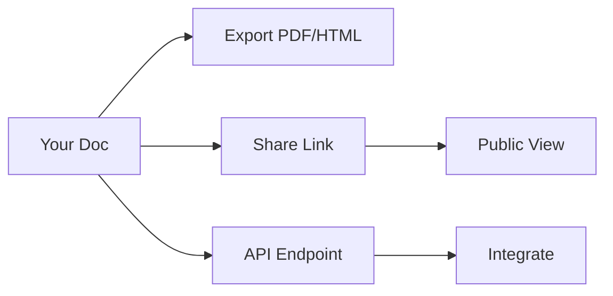

## Overview

godfred osei provides powerful tools to create, collaborate on, and manage your project documentation. You streamline workflows with intuitive editing, version tracking, smart search, and flexible sharing. Key features include rich text editing, real-time collaboration, advanced organization, and multiple export formats.

<Columns cols={2}>
  <Card title="Document Creation" icon="edit-3" href="#document-creation">
    Build docs with Markdown, MDX, and visual components.
  </Card>
  <Card title="Collaboration" icon="users" href="#collaboration">
    Work with teams using version history and comments.
  </Card>
  <Card title="Search & Organization" icon="search" href="#search-organization">
    Find content quickly with tags, folders, and full-text search.
  </Card>
  <Card title="Export & Share" icon="share-2" href="#export-sharing">
    Publish to web, PDF, or API integrations.
  </Card>
</Columns>

## Document Creation and Editing Tools

Create professional documentation using a full-featured editor supporting Markdown, MDX components, and syntax highlighting. You draft content with live previews, embed images, and use components like `<Callout>` for emphasis.

<Steps>
  <Step title="Start a New Document" icon="plus">
    Navigate to your workspace and click "New Doc".

    ```
    POST https://api.example.com/v1/docs
    ```
  </Step>
  <Step title="Edit with MDX" icon="edit-3">
    Use the split-view editor. Add components:

````mdx
<Callout kind="info">
  This is highlighted content.
</Callout>
````

  </Step>
  <Step title="Preview and Save" icon="eye">
    Toggle preview mode and save changes automatically.
  </Step>
</Steps>

<Callout kind="tip">
  Enable auto-save to avoid losing work during long sessions.
</Callout>

## Version Control and Collaboration Features

Track changes with built-in version history and collaborate in real-time. You revert to previous versions, resolve conflicts, and invite team members.

<Tabs>
  <Tab title="Version History" icon="git-branch">
    View diffs and restore versions:

    <CodeGroup tabs="CLI,API">
````bash
godfred version list --doc-id=doc_123
````

````javascript
fetch('https://api.example.com/v1/docs/doc_123/versions')
  .then(res => res.json())
````
    </CodeGroup>
  </Tab>
  <Tab title="Real-time Collaboration" icon="activity">
    Share edit links for live co-editing. Changes sync instantly.
  </Tab>
</Tabs>

## Search and Organization Methods

Organize docs with folders, tags, and powerful search. You query across all content using keywords, filters, or advanced operators.

| Method       | Description                          | Example Query          |
|--------------|--------------------------------------|------------------------|
| Full-text    | Search titles and body               | `authentication flow` |
| Tags         | Filter by custom tags                | `tag:api`             |
| Folders      | Nested organization                  | `folder:projects/sdk` |
| Advanced     | Boolean operators                    | `auth AND (api OR sdk)` |

<Expandable title="Advanced Search Tips" default-open="false">
  Combine operators like `NOT deprecated` to exclude outdated docs. Use `filetype:mdx` for component-heavy files.
</Expandable>

## Export and Sharing Options

Share your docs via public links, embeds, or exports. Generate PDFs, HTML sites, or API endpoints for integration.

<CodeGroup tabs="PDF,HTML,API">
````bash
godfred export doc_123 --format=pdf --output=./docs.pdf
````

````bash
godfred export doc_123 --format=html --output=./site/
````

```javascript
// Embed via API
const embedUrl = `https://docs.example.com/embed/doc_123`;
```
</CodeGroup>



<Callout kind="success">
  Start with document creation to build your first project space. Explore [quickstart](/quickstart) for setup.
</Callout>